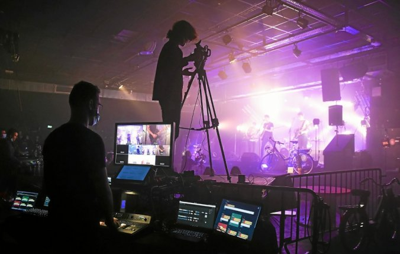

<!-- PROJECT SHIELDS -->
<!--
*** I'm using markdown "reference style" links for readability.
*** Reference links are enclosed in brackets [ ] instead of parentheses ( ).
*** See the bottom of this document for the declaration of the reference variables
*** for contributors-url, forks-url, etc. This is an optional, concise syntax you may use.
*** https://www.markdownguide.org/basic-syntax/#reference-style-links
-->
[![Contributors][contributors-shield]][contributors-url]
[![Forks][forks-shield]][forks-url]
[![Stargazers][stars-shield]][stars-url]
[![Issues][issues-shield]][issues-url]
[![MIT License][license-shield]][license-url]
[![LinkedIn][linkedin-shield]][linkedin-url]


<!-- PROJECT LOGO -->
<br />
<p align="center">
  <a href="https://github.com/VolodiaPG/camera_indicator_atem">
    
  </a>

  <h3 align="center">ATEM Camera Indicator</h3>

  <p align="center">
    Provides an indicator for cameramen to know wether or not they are in Live, Preview or nothing. It helps them to know when they can move, or not. This application also provides a messaging functionnality that can unicast or broadcast messages to the cameramen.
    This application has been tested in live conditions and was helpful. This was our only channel of communication due to the noise levels.
    <!-- <br />
    <a href="https://github.com/VolodiaPG/camera_indicator_atem"><strong>Explore the docs »</strong></a>
    <br />
    <br />
    <a href="https://github.com/VolodiaPG/camera_indicator_atem">View Demo</a>
    ·
    <a href="https://github.com/VolodiaPG/camera_indicator_atem/issues">Report Bug</a>
    ·
    <a href="https://github.com/VolodiaPG/camera_indicator_atem/issues">Request Feature</a> -->
  </p>
</p>


<!-- TABLE OF CONTENTS -->
<details open="open">
  <summary><h2 style="display: inline-block">Table of Contents</h2></summary>
  <ol>
    <li>
      <a href="#about-the-project">About The Project</a>
      <ul>
        <li><a href="#built-with">Built With</a></li>
      </ul>
    </li>
    <li>
      <a href="#getting-started">Getting Started</a>
      <ul>
        <li><a href="#prerequisites">Prerequisites</a></li>
        <li><a href="#installation">Installation</a></li>
      </ul>
    </li>
    <li><a href="#usage">Usage</a></li>
    <li><a href="#roadmap">Roadmap</a></li>
    <li><a href="#how">How</a></li>
    <!-- <li><a href="#contributing">Contributing</a></li> -->
    <li><a href="#license">License</a></li>
    <li><a href="#contact">Contact</a></li>
    <li><a href="#acknowledgements">Acknowledgements</a></li>
  </ol>
</details>


<!-- ABOUT THE PROJECT -->
## About The Project

This application has been developed for the InsaLive association at the INSA Rennes. It was used to stream the [Rock'n Solex](https://rocknsolex.fr/) 2021 music festival.

This project is also a proof of concept regarding the technologies employed.

[Here is a small article (in french) from « Le Télégramme »](https://www.letelegramme.fr/ille-et-vilaine/rennes/festival-dans-les-coulisses-du-rock-n-solex-2021-en-ligne-16-05-2021-12750646.php). You can also see the software being used on the image : on both the rightmost and leftmost computer and also on the one in front of me.

Here are the two nights produced using this software :
* <https://www.youtube.com/watch?v=E7rawN8GP1A>
* <https://www.youtube.com/watch?v=xZzG2Ggr2TY>


### Built With

* [Rust](https://www.rust-lang.org/)
* [Warp](https://github.com/seanmonstar/warp)
* [Svelte](https://svelte.dev/)
* [SvelteStrap (Bootstrap)](https://sveltestrap.js.org/)


<!-- GETTING STARTED -->
## Getting Started

* Quickstart
  1. Download the application from the [releases](https://github.com/VolodiaPG/camera_indicator_atem/releases)
  2. Unzip
  3. See <a href="#usage">Usage</a>

* Manual

  1. Clone this repository
    ```sh
    git clone https://github.com/VolodiaPG/camera_indicator_atem.git
    ```
  2. Proceed to the next instructions

### Prerequisites

* [Install Rust](https://www.rust-lang.org/tools/install)
* [Install Node](https://nodejs.org/en/download/)

> I recommend VSCode alongside with this extension: `matklad.rust-analyzer` 


### Installation

#### Frontend
1. Install NPM packages
   ```sh
   npm install
   ```
2. Start development server:
   ```sh
   npm run dev
   ```

#### Backend

1. Compile in development mode
   ```sh
   make dev
   ```
2. Start the ATEM powershell script **as Administrator** under `back/atem.ps1`


<!-- USAGE EXAMPLES -->
## Usage

1. Typical use is 
  ``` sh
  ./camera_indicator_atem --ip <exposed ip>
  ```

  More can be printed using `--help`, such as the port configuration.

2. Then start the `atem.ps1` powershell script **as Administrator**. Tweaking your script execution permissions may be necessary.


<!-- ROADMAP -->
## Roadmap

This project is a proof of concept, if you are interested into further development, contact me.

## How

* This work has been made possible thanks to the amazing [library](https://ianmorrish.wordpress.com/v-ise/atem/) of [Ian Morrish](https://ianmorrish.wordpress.com/about/)
* It may only works under windows to leverage the DLL and its powershell integration
* The script POST its update (when it has a new one) on the backend. Then the message is broadcasted. (Having the script embedded inside the backend did not work as excepted)
* This project uses Websockets to guarantee a fast notification time AND the ability for the backend to send messages to the frontend (maintaining the connection opened)

<!-- CONTRIBUTING
## Contributing

Contributions are what make the open source community such an amazing place to be learn, inspire, and create. Any contributions you make are **greatly appreciated**.

1. Fork the Project
2. Create your Feature Branch (`git checkout -b feature/AmazingFeature`)
3. Commit your Changes (`git commit -m 'Add some AmazingFeature'`)
4. Push to the Branch (`git push origin feature/AmazingFeature`)
5. Open a Pull Request -->


<!-- LICENSE -->
## License

Distributed under the MIT License. See `LICENSE` for more information.

> Note: A part of the Backend is under Mario Zupan's MIT License. The modifications made from that point are under mine.


<!-- CONTACT -->
## Contact

Volodia PAROL-GUARINO - volodia.parol-guarino@pm.me

Project Link: [https://github.com/VolodiaPG/camera_indicator_atem](https://github.com/VolodiaPG/camera_indicator_atem)


<!-- ACKNOWLEDGEMENTS -->
## Acknowledgements

* [INSA Rennes](https://www.insa-rennes.fr/)
* [ATEM Television](https://www.blackmagicdesign.com/products/atemtelevisionstudio)
* Image credits go to « Le Télégramme/Marion Dugrenier »


<!-- MARKDOWN LINKS & IMAGES -->
<!-- https://www.markdownguide.org/basic-syntax/#reference-style-links -->
[contributors-shield]: https://img.shields.io/github/contributors/VolodiaPG/camera_indicator_atem.svg?style=for-the-badge
[contributors-url]: https://github.com/VolodiaPG/camera_indicator_atem/graphs/contributors
[forks-shield]: https://img.shields.io/github/forks/VolodiaPG/camera_indicator_atem.svg?style=for-the-badge
[forks-url]: https://github.com/VolodiaPG/camera_indicator_atem/network/members
[stars-shield]: https://img.shields.io/github/stars/VolodiaPG/camera_indicator_atem.svg?style=for-the-badge
[stars-url]: https://github.com/VolodiaPG/camera_indicator_atem/stargazers
[issues-shield]: https://img.shields.io/github/issues/VolodiaPG/camera_indicator_atem.svg?style=for-the-badge
[issues-url]: https://github.com/VolodiaPG/camera_indicator_atem/issues
[license-shield]: https://img.shields.io/github/license/VolodiaPG/camera_indicator_atem.svg?style=for-the-badge
[license-url]: https://github.com/VolodiaPG/camera_indicator_atem/blob/master/LICENSE
[linkedin-shield]: https://img.shields.io/badge/-LinkedIn-black.svg?style=for-the-badge&logo=linkedin&colorB=555
[linkedin-url]: https://www.linkedin.com/in/volodia-parol-guarino/
